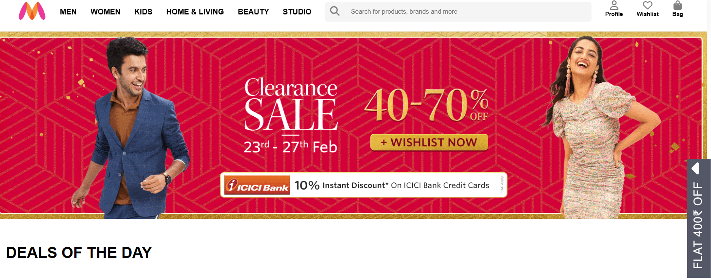
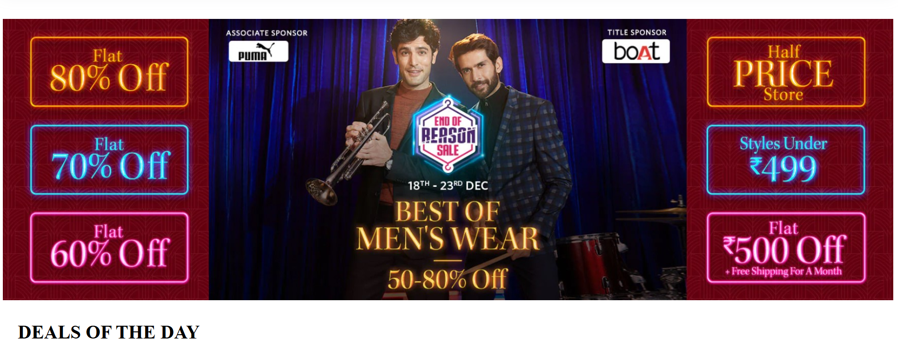
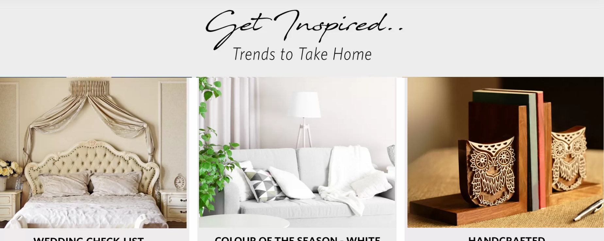
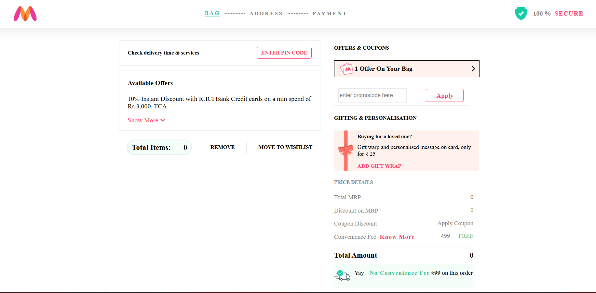

**Myntra Clone Project**

This is a clone project of Myntra, an online fashion and lifestyle store. The project is built using HTML, CSS, JS, and Node.js.
Myntra is a major Indian fashion e-commerce company headquartered in Bengaluru, Karnataka, India. The company was founded in 2007 to sell personalized gift items. In May 2014, Myntra.com was acquired by Flipkart.

Hello

**Installation**

To run the Myntra clone project, follow these steps:

1-> Clone the repository.
2-> Install the dependencies.
3-> Start the server.

**Images of Project**

**HOMEPAGE** 
This is the homepage , in this homepage we have a navigation bar, on clicking any option on the navigation bar it will navigate to the others pages on websites.

**Outer and inner Men’s page**

On this outer men’s page, we have brands of men’s clothing and their accessories. on clicking any of the brands it will redirect to the men’s inner page where we have options of wishlist and add to bag and filter items option.
on clicking the wishlist option it will add the product to the wishlist, 
and on clicking add to bag it will add the product to the bag. filter items option in this option we have names of brands, prices, and sorting

**Outer and inner women’s page.**
On this outer women’s page, we have brands of women’s clothing and their accessories. on clicking any of the brands it will redirect to the women’s inner page where we have options of wishlist and add to bag and filter items option.
on clicking the wishlist option it will add the product to the wishlist, and on clicking add to bag it will add the product to the bag. 
filter items option in this option we have names of brands, prices, and sorting.

**Outer and inner home living page.**
On this outer home living page, we have brands of home living products. on clicking any of the brands it will redirect to the home living inner page where we have options of wishlist and 
add to bag and filter items option. on clicking the wishlist option it will add the product to the wishlist, and on clicking add to bag it will add the product to the bag. 
filter items option in this option we have names of brands, prices, and sorting.

**Login or signup page.**
This is our login page Here we integrate User authentication to check whether the user email and password match with details existing in the database.

**Payment page.**
This is our payment page after placing an order, the user will have some options for payment. e.g cash on delivery, debit/credit card, etc.

